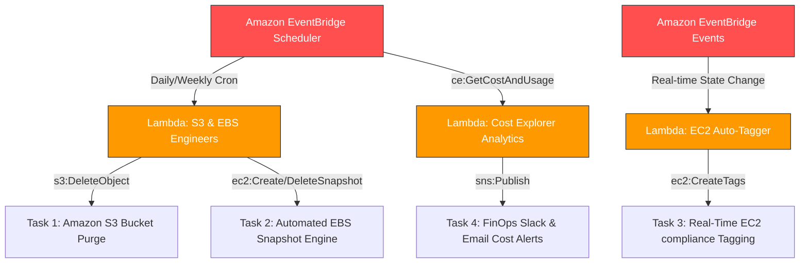

# AWS Cloud Automation Engine Portfolio

A production-grade suite of event-driven, serverless automation frameworks designed to optimize costs, enforce lifecycle security baselines, and inject programmatic governance across AWS infrastructure pools.

---

## 🏗️ Architecture System Blueprint

This portfolio showcases four main architectural patterns utilizing **AWS Lambda (Python/Boto3)**, **Amazon EventBridge**, **Amazon SNS**, and native cloud monitoring APIs:



---

## 📁 Repository Structure

Each automation component is fully self-contained inside its respective directory, complete with zero-dependency source code, least-privilege IAM configuration frameworks, and granular configuration runbooks.

```text
.
├── 01-s3-bucket-cleanup/
│   ├── lambda_function.py      # Boto3 object lifecycle execution script
│   └── README.md               # Step-by-step S3 setup & lifecycle discussion points
├── 02-ebs-snapshot-manager/
│   ├── lambda_function.py      # Targeted snapshot creation & retention loop 
│   └── README.md               # IAM inline policy guides & DLM trade-off analysis
├── 03-ec2-auto-tagger/
│   ├── lambda_function.py      # Real-time metadata tracking engine
│   └── README.md               # Event pattern rules & CloudTrail user-extraction bonus
└── 04-daily-cost-notifier/
    ├── lambda_function.py      # Month-to-Date FinOps calculation core
    └── README.md               # SNS subscription configurations & AWS Budgets comparison
```

---

## 🚀 Module Executive Summaries

### [Task 1: Automated S3 Bucket Cleanup](./01-s3-bucket-cleanup/)
*   **Objective**: Mitigate structural storage bloat by automatically purging stale objects.
*   **Core Logic**: Iterates across target bucket namespaces using `s3.list_objects_v2`, evaluates object age properties via UTC timezone arrays, and issues atomic `DeleteObject` calls for files exceeding a 30-day lifecycle threshold.
*   **Trigger**: Daily EventBridge Scheduler rules.

### [Task 2: Automated EBS Snapshot Creation and Cleanup](./02-ebs-snapshot-manager/)
*   **Objective**: Establish a custom, programmatic data recovery engine for block storage components.
*   **Core Logic**: Generates an isolated volume snapshot tagged with custom runtime metadata markers (`CreatedBy=Lambda-Backup`), sweeps for historical backups owning that matching signature, and programmatically purges targets older than a 30-day retention window.
*   **Trigger**: Weekly EventBridge cron orchestration.

### [Task 3: Auto-Tagging EC2 Instances on Launch](./03-ec2-auto-tagger/)
*   **Objective**: Enforce runtime structural tracking, explicit ownership mapping, and resource allocation tags.
*   **Core Logic**: Intercepts real-time `EC2 Instance State-change Notification` payloads, extracts target instance metadata coordinates, and dynamically injects global tags including `LaunchDate`, `Environment`, and `Owner` at initialization.
*   **Trigger**: Real-time EventBridge State Match (`running`).

### [Task 4: Daily AWS Cost Alert Engine](./04-daily-cost-notifier/)
*   **Objective**: Implement modern FinOps boundaries to avoid surprise budget spikes without legacy CloudWatch mechanisms.
*   **Core Logic**: Interrogates the global AWS Cost Explorer API (`ce:GetCostAndUsage`) to compute precise Month-to-Date (MTD) unblended expenditures and issues high-priority notification traces down an Amazon SNS email/webhook delivery pipeline if financial ceilings are breached.
*   **Trigger**: Daily automated morning evaluation check.

---

## 🛡️ Enterprise Governance & Best Practices Applied

*   **Least-Privilege Scoping**: Every automation pipeline runs under its own localized IAM Execution Role, completely eliminating wildcard (`"Resource": "*"`) permissions for state mutations.
*   **Network-Independent Configurations**: Functions are built to decouple from strict private VPC isolation boundaries unless specifically routed to dedicated endpoint infrastructure, preventing API execution timeout bugs.
*   **Serverless Efficiency**: Compute pipelines run strictly on an event-driven basis—zero infrastructure assets are left running idle, ensuring total compliance framework upkeep for less than pennies per month.

***
*For specific step-by-step instructions, copy-pasteable JSON IAM policies, and manual validation testing configurations, please open the dedicated subfolders listed above.*
