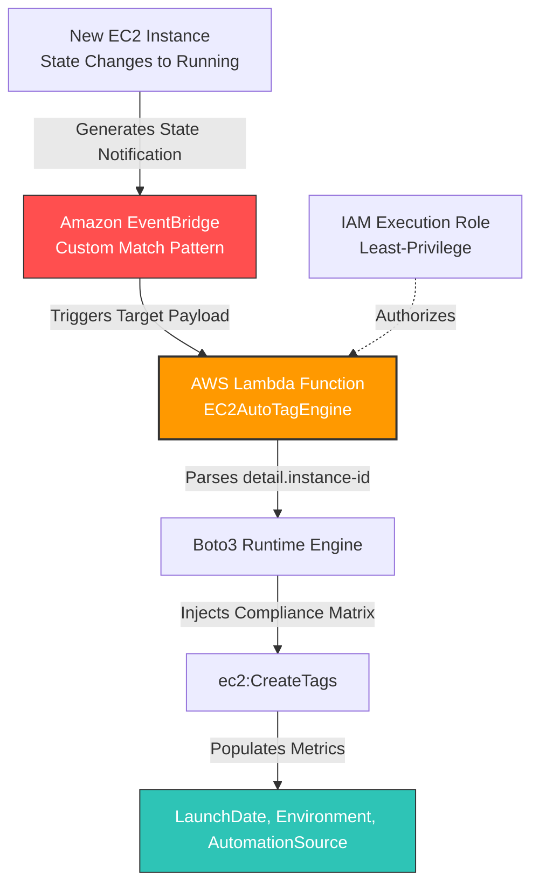

# Automated EC2 Resource Tagging Architecture

An event-driven AWS serverless implementation designed to automate corporate compliance, lifecycle tracking, and cost allocation metadata injection. This engine listens for specific compute-state mutations and automatically tags freshly initialized EC2 instances at runtime using Python (Boto3) and Amazon EventBridge.

## Architecture Blueprint



---

## 🛠️ Step-by-Step Deployment Procedure

### Step 1: Set Up Least-Privilege IAM Execution Role
1. Navigate to the **IAM Console** and select **Roles** > **Create role**.
2. Select **AWS service** as the trusted entity and **Lambda** as the explicit service use case. Click **Next**.
3. Advance to the final step, name your target role `LambdaEC2AutoTagExecutionRole`, and click **Create role**.
4. Locate your new role, select **Add permissions** > **Create inline policy**, and toggle the **JSON** configuration block layout.
5. Paste the following assignment-compliant security payload:

```json
{
    "Version": "2012-10-17",
    "Statement": [
        {
            "Sid": "EC2TaggingPermissions",
            "Effect": "Allow",
            "Action": [
                "ec2:CreateTags",
                "ec2:DescribeInstances"
            ],
            "Resource": "*"
        },
        {
            "Sid": "CloudWatchLogging",
            "Effect": "Allow",
            "Action": [
                "logs:CreateLogGroup",
                "logs:CreateLogStream",
                "logs:PutLogEvents"
            ],
            "Resource": "arn:aws:logs:*:*:*"
        }
    ]
}
```
6. Name your newly created policy configuration `EC2AutoTagInlinePolicy` and finalize creation.

### Step 2: Provision the Lambda Automation Engine
1. Head over to the **AWS Lambda Console** and choose **Create function** > **Author from scratch**.
2. Use the following baseline parameters:
   * **Function name**: `EC2AutoTagEngine`
   * **Runtime**: `Python 3.12` (or latest modern Python 3.x stack)
   * **Execution role**: *Use an existing role* -> Select `LambdaEC2AutoTagExecutionRole`.
3. In the **Code source** dashboard frame, paste the source block defined within the [Source Code](#source-code) index below directly over the baseline `lambda_function.py` contents.
4. Click **Deploy** to secure compilation.

### Step 3: Hook the EventBridge Interception Pattern
1. Open the **Amazon EventBridge Console** and select **Rules** > **Create rule**.
2. Assign your automation block the identifier `EC2InstanceRunningTrigger`, pick the **Default** bus route, and define the Rule Type as **Rule with an event pattern**.
3. Within the **Event pattern** panel selector block, click **Custom pattern (JSON editor)** and drop in this structural configuration:

```json
{
  "source": ["aws.ec2"],
  "detail-type": ["EC2 Instance State-change Notification"],
  "detail": {
    "state": ["running"]
  }
}
```
4. Define the downstream execution target parameters as **AWS service** -> **Lambda function**, pointing the interface dropdown cleanly down to your deployed `EC2AutoTagEngine`.
5. Run through the rest of the confirmation panes and select **Create rule**.

---

## 💻 Source Code

```python
import boto3
import datetime

def lambda_handler(event, context):
    ec2 = boto3.client('ec2')
    
    # 1. Parse instance identity and runtime operational metrics from the payload
    instance_id = event.get('detail', {}).get('instance-id')
    state = event.get('detail', {}).get('state')
    
    if not instance_id:
        print("ERROR: Event payload is missing a valid instance-id attribute.")
        return
        
    print(f"Intercepted state-change notification. Instance: {instance_id} is in '{state}' state.")
    
    # Generate timestamp metrics matching target environment requirements
    current_date = datetime.datetime.now(datetime.timezone.utc).strftime("%Y-%m-%d")
    
    # 2. Construct tag arrays mapping out corporate ownership definitions
    tags_to_apply = [
        {'Key': 'LaunchDate', 'Value': current_date},
        {'Key': 'Environment', 'Value': 'Development'},
        {'Key': 'AutomationSource', 'Value': 'Lambda-AutoTag'}
    ]
    
    # 3. Inject tags into the newly spun-up infrastructure footprint
    try:
        ec2.create_tags(
            Resources=[instance_id],
            Tags=tags_to_apply
        )
        print(f"SUCCESS: Applied compliance tags to Instance {instance_id}: {tags_to_apply}")
    except Exception as e:
        print(f"CRITICAL: Failed to apply compliance tags to instance {instance_id}: {e}")
```

---

## 🌟 Bonus: Extracting Launching IAM Identity via CloudTrail

For advanced production scenarios, you can capture the exact user identity that initialized the deployment footprint by altering your event pattern to intercept **AWS API Call via CloudTrail** signatures matching `RunInstances`. 

Below is an optimized Boto3 code adjustment block designed to trace the original user identity and automatically inject an explicit `Owner` metadata parameter:

```python
# Insert this operational tracking logic directly into an API-driven trigger block
user_identity = event.get('detail', {}).get('userIdentity', {})
principal_type = user_identity.get('type')

if principal_type == 'IAMUser':
    owner_identity = user_identity.get('userName')
elif principal_type == 'AssumedRole':
    owner_identity = user_identity.get('arn', '').split('/')[-1]
else:
    owner_identity = 'AutomatedSystem'

# Add the parsed identity dynamically into your target metadata parameters
tags_to_apply.append({'Key': 'Owner', 'Value': owner_identity})
```
