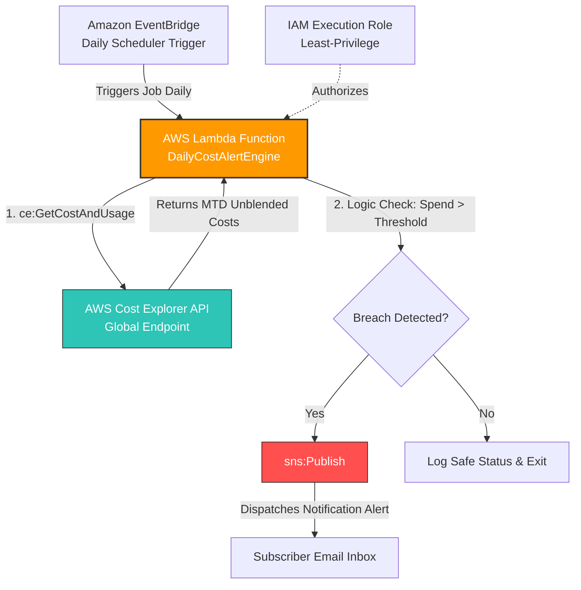

# Automated AWS Cost Monitoring & Alerting Engine

An event-driven FinOps automation solution that leverages the AWS Cost Explorer API (`ce:GetCostAndUsage`) and Amazon Simple Notification Service (SNS) to calculate Month-to-Date (MTD) unblended expenditures and dispatch immediate structural email alerts upon threshold breaches.

## Architecture Blueprint



---

## 🛠️ Step-by-Step Deployment Procedure

### Step 1: Provision and Validate the SNS Topic
1. Open the **Amazon SNS Console** and select **Topics** > **Create topic**.
2. Choose **Standard** as the underlying structural layout type, name the asset `BillingCostAlertsTopic`, and save.
3. Copy the resource **ARN** configuration string for later injection points.
4. Under the **Subscriptions** tab at the bottom, select **Create subscription**.
5. Map out the configuration using **Email** protocol mapping and drop your destination address into the **Endpoint** box.
6. Check your email inbox and click **Confirm subscription** inside the confirmation message sent from AWS.

### Step 2: Configure Least-Privilege IAM Execution Role
1. Navigate to the **IAM Console** and select **Roles** > **Create role**.
2. Select **AWS service** as the trusted entity and **Lambda** as the explicit service use case. Click **Next**.
3. Advance to the final step, name the role `LambdaCostExplorerExecutionRole`, and click **Create role**.
4. Open your new role, select **Add permissions** > **Create inline policy**, and toggle the **JSON** configuration block layout.
5. Paste the following assignment-compliant security policy (replace `YOUR_SNS_TOPIC_ARN` with your true identifier resource string):

```json
{
    "Version": "2012-10-17",
    "Statement": [
        {
            "Sid": "CostExplorerMetricsAccess",
            "Effect": "Allow",
            "Action": "ce:GetCostAndUsage",
            "Resource": "*"
        },
        {
            "Sid": "TargetedSNSPublishing",
            "Effect": "Allow",
            "Action": "sns:Publish",
            "Resource": "YOUR_SNS_TOPIC_ARN"
        },
        {
            "Sid": "CloudWatchLogging",
            "Effect": "Allow",
            "Action": [
                "logs:CreateLogGroup",
                "logs:CreateLogStream",
                "logs:PutLogEvents"
            ],
            "Resource": "arn:aws:logs:*:*:*"
        }
    ]
}
```
6. Name your newly created policy configuration `CostMonitoringInlinePolicy` and save.

### Step 3: Provision the Lambda Automation Engine
1. Head over to the **AWS Lambda Console** and choose **Create function** > **Author from scratch**.
2. Use the following baseline parameters:
   * **Function name**: `DailyCostAlertEngine`
   * **Runtime**: `Python 3.12` (or latest modern Python 3.x stack)
   * **Execution role**: *Use an existing role* -> Select `LambdaCostExplorerExecutionRole`.
3. In the **Code source** dashboard frame, paste the source block defined within the [Source Code](#source-code) index below directly over the baseline `lambda_function.py` contents.
4. Update line 6 (`SNS_TOPIC_ARN`) with your real SNS destination resource string value.
5. Click **Deploy** to secure compilation.
6. Navigate to **Configuration** > **General configuration** > **Edit**. Set the **Timeout** parameter to **1 minute** and save.

### Step 4: Hook the EventBridge Interception Pattern
1. Open the **Amazon EventBridge Console** and select **Schedules** > **Create schedule**.
2. Name the schedule `DailyCostEvaluationTrigger`, configure a recurring **Cron-based schedule** with the string value `0 8 * * ? *` (running every morning at 08:00 AM UTC), and toggle the flexible window mechanism to **Off**.
3. Choose **AWS service** -> **Lambda function** as the target routing mechanism, and point the interface dropdown cleanly down to your deployed `DailyCostAlertEngine`.
4. Run through the rest of the confirmation panes and select **Create schedule**.

---

## 💻 Source Code

```python
import boto3
import datetime
from botocore.exceptions import ClientError

# Configuration variables
SNS_TOPIC_ARN = "YOUR_SNS_TOPIC_ARN_HERE"
COST_THRESHOLD = 0.01  # Set to \$0.01 to guarantee a trigger during manual assignment testing

def lambda_handler(event, context):
    ce = boto3.client('ce', region_name='us-east-1')  # Cost Explorer endpoint is global (us-east-1)
    sns = boto3.client('sns')
    
    # 1. Dynamically compute the boundary window for Month-to-Date (MTD) tracking
    today = datetime.date.today()
    start_of_month = today.replace(day=1).strftime('%Y-%m-%d')
    end_of_query = today.strftime('%Y-%m-%d')
    
    # Handle edge case where today is the 1st of the month
    if start_of_month == end_of_query:
        print("First day of the month detected. Skipping analysis due to zero baseline metrics.")
        return
        
    print(f"Querying MTD AWS cost metrics from {start_of_month} to {end_of_query}")
    
    # 2. Query data through the Cost Explorer API endpoint
    try:
        response = ce.get_cost_and_usage(
            TimePeriod={'Start': start_of_month, 'End': end_of_query},
            Granularity='MONTHLY',
            Metrics=['UnblendedCost']
        )
        
        # Parse unblended pricing values out of JSON metric frames
        raw_amount = response['ResultsByTime'][0]['Total']['UnblendedCost']['Amount']
        current_spend = float(raw_amount)
        print(f"RETRIEVED AMOUNT: Current MTD Unblended Cost is \${current_spend:.2f}")
        
    except ClientError as e:
        print(f"CRITICAL: Failed to query Cost Explorer data: {e}")
        return

    # 3. Check threshold logic and execute conditional alerting pipelines
    if current_spend > COST_THRESHOLD:
        print(f"THRESHOLD EXCEEDED: \({current_spend:.2f} is greater than\){COST_THRESHOLD:.2f}. Dispatched alert email.")
        
        alert_message = (
            f"ALERT: Your AWS Month-to-Date spend has breached your safety threshold!\n\n"
            f"Current MTD Cost: \${current_spend:.2f}\n"
            f"Configured Threshold Limit: \${COST_THRESHOLD:.2f}\n"
            f"Reporting Target Window: {start_of_month} to {end_of_query}\n\n"
            f"This email was dispatched via automated Lambda analytics infrastructure."
        )
        
        try:
            sns.publish(
                TopicArn=SNS_TOPIC_ARN,
                Subject="⚠️ AWS Budget Breach Notification",
                Message=alert_message
            )
            print("SUCCESS: Alert message sent to SNS topic.")
        except ClientError as e:
            print(f"ERROR: Failed to push notification trace to SNS: {e}")
    else:
        print(f"OK: Current spend (\({current_spend:.2f}) remains within safe limits (\){COST_THRESHOLD:.2f}).")
```

---

## 🧠 Architectural Trade-offs: Lambda vs. AWS Budgets

While **AWS Budgets** acts as the native, zero-code wizard configuration tool designed to monitor and alert on predefined cost thresholds across cloud environments, custom **AWS Lambda implementation** is required for advanced scenarios:

*   **Granular Service Breakdown Breakdowns**: AWS Budgets triggers generic threshold warnings. A Lambda function can dynamically split the metrics query payload block to find the exact top 3 cost-generating services and include them directly in the body of the notification.
*   **Alternative Notification Destination Routing**: AWS Budgets relies heavily on SNS and raw emails. Custom Lambda functions allow you to inject formatting loops to hit external API webhooks directly, such as sending rich cards into corporate Slack or Microsoft Teams channels.
*   **Programmatic Remediation and Anomaly Control Logic**: Lambda allows you to build an active defense system. Beyond sending an email, your script can automatically alter IAM access parameters, stop expensive development resources, or delete untagged instances if budget margins are heavily breached.
